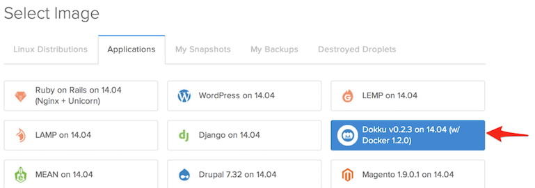
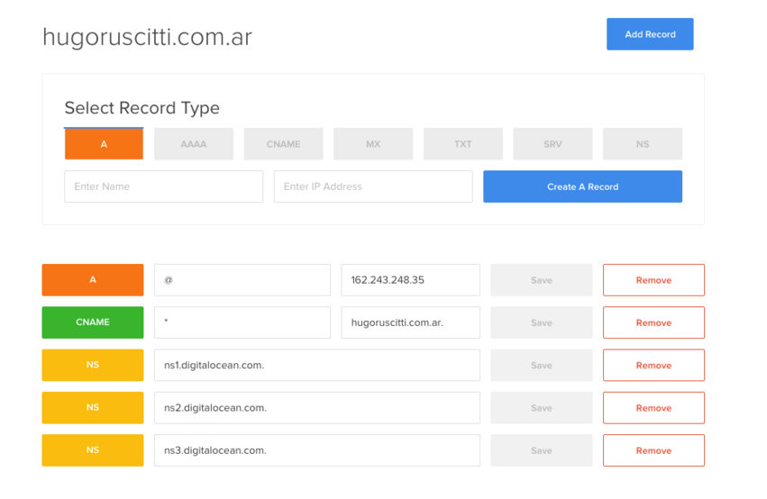

# Ember-on-dokku

Este es un ejemplo sencillo de utilización de dokku y ember-cli.

[dokku](http://dokku.viewdocs.io/dokku/) es una plataforma para ejecutar aplicaciones sobre docker, similar a heroku desde el punto de vista del desarrollador.

Con dokku los deploys se pueden iniciar haciendo ``git push`` al servidor de dokku, y como resultado del deploy se muestra una URL de acceso a la aplicación instanciada.


## ¿Qué tiene de particular?

No mucho, el repositorio es una aplicación ember tradicional, iniciada con ``ember init``, pero que contiene un archivo adicional llamado [.env](https://github.com/hugoruscitti/ember-on-dokku/blob/master/.env) con este contenido:


```
export BUILDPACK_URL='https://github.com/tonycoco/heroku-buildpack-ember-cli.git'
```

## ¿Cómo hacer deploys?

En mi caso, tengo un dominio apuntando a una imagen dokku en digitalocean. La imagen de dokku se puede replicar creando un nuevo droplet y seleccionado la imagen:



Luego, nuevamente en mi caso, hay un dominio apuntando al equipo:



Al menos una vez hay que crear la aplicación:

```
ssh dokku@hugoruscitti.com.ar apps:create ember-on-dokku
```


y por último, para vincular el repositorio a dokku y hacer un deploy ejecuto lo siguiente:

```
git remote add dokku dokku@hugoruscitti.com.ar:ember-on-dokku
git push dokku master
```

El resultado del deploy se ve así:

```
> git push dokku master

Counting objects: 6, done.
Delta compression using up to 4 threads.
Compressing objects: 100% (6/6), done.
Writing objects: 100% (6/6), 677 bytes | 0 bytes/s, done.
Total 6 (delta 2), reused 0 (delta 0)
-----> Cleaning up...
-----> Building ember-on-dokku from herokuish...
-----> Adding BUILD_ENV to build environment...
-----> Fetching custom buildpack
-----> Ember CLI app detected

[ ... ]
OMITIENDO ALGUNOS MENSAJES
[ ... ]

-----> Setting config vars
       DOKKU_APP_RESTORE: 1
-----> Shutting down old containers in 60 seconds
=====> 8cd104a1d4e4d6360bbeb25398abab53b081d7b0b92a4401900a96f390a50579
=====> Application deployed:
       http://ember-on-dokku.hugoruscitti.com.ar

```

Notá que el último mensaje es la URL de la aplicación creada:

- http://ember-on-dokku.hugoruscitti.com.ar
